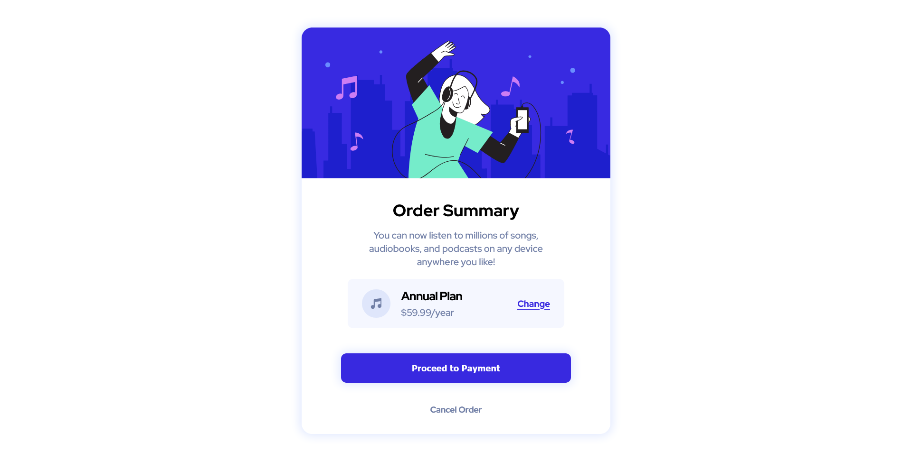

# Frontend Mentor - Order summary card solution

This is a solution to the [Order summary card challenge on Frontend Mentor](https://www.frontendmentor.io/challenges/order-summary-component-QlPmajDUj). Frontend Mentor challenges help you improve your coding skills by building realistic projects.

## Table of contents

- [Overview](#overview)
  - [The challenge](#the-challenge)
  - [Screenshot](#screenshot)
  - [Links](#links)
  - [Built with](#built-with)
- [Author](#author)

## Overview

- Completed the Frontend mentor challenge to create a summary card compnent.
- Used responsive unit rem throughout to size my elements.

### The challenge

Users should be able to:

- See hover states for interactive elements

### Screenshot

### Links

- Solution URL: [Solution URL](https://github.com/PrayagTandon/Card-summary)
- Live Site URL: [Live site URL](https://card-summary-prayag.netlify.app/)

### Built with

- Semantic HTML5 markup
- CSS custom properties
- Flexbox
- CSS Grid

## Author

- Website - [Prayag Tandon](https://prayag.webflow.io/)
- Frontend Mentor - [@PrayagTandon](https://www.frontendmentor.io/profile/PrayagTandon)
